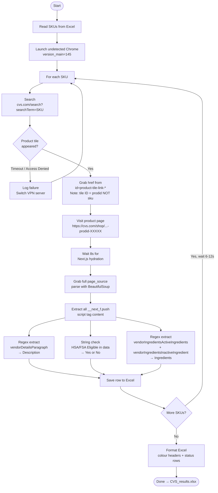

# CVS Store Brand SKU Scraper

Scrapes CVS.com product pages for store brand SKUs — extracting product URLs, descriptions, HSA/FSA eligibility, and ingredients — and saves everything to a formatted Excel file.

---

## What Works ✅ and What Doesn't ❌

| Approach | Status | Reason |
|---|---|---|
| `undetected-chromedriver` + fresh VPN IP | ✅ **Works** | Bypasses Akamai bot detection |
| Playwright (headless or stealth) | ❌ **Blocked** | Akamai detects CDP protocol |
| Firecrawl free tier | ❌ **Broken** | Returns empty HTML (JS not rendered) |
| ScraperAPI | ⚠️ **Untested** | Should work but costs money |
| `undetected-chromedriver` on flagged IP | ❌ **Blocked** | Akamai flags datacenter/repeated IPs |
| BeautifulSoup CSS selectors on product page | ❌ **Fails** | Content lives inside Next.js script JSON, not HTML elements |
| Regex on Next.js `__next_f.push` script data | ✅ **Works** | All product data is embedded as JSON in `<script>` tags |

---

## Workflow



---

## Setup

### Requirements

- Windows PC (tested on Windows 10/11)
- Google Chrome version 145 installed
- US VPN — **Windscribe with Stealth protocol** recommended
  - Use residential or less-flagged servers (e.g. New York Empire, Chicago Bean)
  - Avoid servers you've used heavily — Akamai flags repeated IPs

### Install dependencies

```bash
pip install undetected-chromedriver selenium beautifulsoup4 pandas openpyxl python-dotenv
```

### ChromeDriver setup (one-time)

1. Disconnect VPN
2. Run the scraper once — `undetected-chromedriver` auto-downloads and patches the correct ChromeDriver
3. Reconnect VPN
4. ChromeDriver is now cached locally, VPN no longer needed for this step

> If you see `ChromeDriver only supports Chrome version 146` → update `version_main=145` in the script to match your Chrome version (check at `chrome://version`)

---

## Project Structure

```
scraper/
├── CVS store brand skus.xlsx     ← Input file (4114 SKUs)
├── cvs_10skus.py                 ← Main scraper (10 SKUs)
├── CVS_results.xlsx              ← Output file (auto-created)
└── .env                          ← Optional (GROQ_API_KEY if using AI extraction)
```

---

## Usage

```bash
# Scrape first 10 SKUs
python cvs_10skus.py
```

To change the number of SKUs, edit this line in `cvs_10skus.py`:
```python
NUM_SKUS = 10   # change to any number
```

---

## How It Actually Works

### Step 1 — Search page
CVS search by SKU always returns exactly **1 result** — the correct product.
The product tile renders as:
```html
<a id="product-tile-link-1720001"
   href="/shop/total-home-deep-dish-storage-containers-3-ct-prodid-1720001">
```
**Important:** The tile `id` uses the internal `prodid` (e.g. `1720001`), NOT the SKU number (e.g. `999279`). So we wait for `[id^='product-tile-link-']` — any tile — not a SKU-specific one.

### Step 2 — Product page
CVS uses **Next.js** — all product data is server-rendered and embedded in `<script>` tags as JSON strings, not in visible HTML elements. This is why CSS selectors return 0 results and BeautifulSoup finds nothing in the DOM.

The data lives inside `self.__next_f.push(...)` calls and looks like:
```
\"vendorDetailsParagraph\":\"Compare to Mucinex® Fast-Max®...\"
\"vendorIngredientsActiveIngredients\":\"Active ingredients (in each 20 mL): acetaminophen...\"
34:[\"HSA/FSA Eligible.\",\"NASAL DECONGESTANT:...\"
```

### Step 3 — Extraction
We collect all `__next_f.push` script content and use regex + string search:

| Field | Method | JSON key |
|---|---|---|
| Description | Regex | `vendorDetailsParagraph` |
| HSA/FSA | String search | `"HSA/FSA Eligible"` anywhere in data |
| Active Ingredients | Regex | `vendorIngredientsActiveIngredients` |
| Inactive Ingredients | Regex | `vendorIngredientsInactiveIngredient` |

---

## Handling Access Denied (Akamai Bot Detection)

CVS uses **Akamai Bot Manager** which tracks:
- IP reputation (datacenter/VPN IPs get flagged)
- Session length (too many requests = flagged)
- Browser fingerprints

**When you get Access Denied:**
1. Clear Chrome browsing data (`Ctrl+Shift+Delete` → All time → Clear)
2. Switch to a different Windscribe US server
3. Re-run the script

**Best practice:** Switch VPN server every 5-8 SKUs to avoid IP flagging. The script saves progress after every SKU so you never lose data.

---

## Output Excel Format

| Column | Description |
|---|---|
| Sku Nbr | Original SKU from input |
| Product Name | From input Excel |
| Product URL | Full CVS product URL |
| H/FSA Eligible | Yes / No |
| Product Description | From `vendorDetailsParagraph` |
| Ingredients | Active + Inactive combined |
| Scrape Status | Success / ACCESS_DENIED / Not found |

- 🟩 Green = Success / HSA eligible
- 🟥 Red = Failed / Access denied
