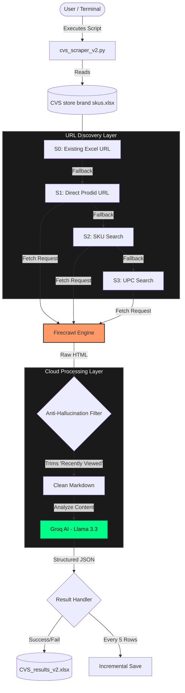

## 💊 CVS Store Brand SKU Scraper v2

A high-precision automated tool designed to resolve product URLs and extract critical data (FSA/HSA eligibility, ingredients, and pricing) from CVS store brand products. This version features a robust "anti-hallucination" logic to ensure data accuracy.

## 🔄 System Workflow

The following diagram illustrates how the data flows from your Excel file, through the cloud-based extraction layers, and back to your local machine.


## 🛠️ Key Logic Components

### 1. Multi-Strategy URL Resolution

The script doesn't rely on a single search. It uses a cascading fallback system:

Strategy 0: Reuses URLs already present in the source file.

Strategy 1 (Direct): Constructs a URL based on the prodid-{SKU} pattern.

Strategy 2 (Search): Performs a live search query for the specific SKU.

Strategy 3 (UPC): Uses the 12-digit UPC code if available to ensure exact matches.

### 2. The "Anti-Hallucination" Filter

CVS product pages often include "Recently Viewed" or "Recommended" items at the bottom. v1 of this scraper sometimes mistakenly scraped those instead of the main product. v2 implements a _extract_main_results_hrefs function that cuts the HTML source code at specific markers before parsing links.

### 3. AI-Powered Extraction

Instead of fragile CSS selectors, we use Groq (Llama-3.3-70b) to read the page content. This allows the script to:

Identify H/FSA Eligibility even if the text varies (e.g., "FSA Approved" vs "HSA Eligible").

Cleanly parse long, messy ingredient strings.

Extract prices even when they are hidden in complex promotional banners.

## 🚀 Execution Guide

### 1. Installation

Install the required dependencies using pip:
```bash
pip install firecrawl-py groq pandas openpyxl python-dotenv
```

### 2. API Setup

Create a .env file in the project root:
```bash
FIRECRAWL_API_KEY=fc-your_key_here
GROQ_API_KEY=gsk_your_key_here
```

### 3. Running the Scraper

The script supports a --limit flag for testing and a --delay flag to manage rate limits.

Test a small batch (10 items):

python cvs_scraper_v2.py --limit 10


Run the full inventory:
```bash
python cvs_scraper_v2.py
```

## 📊 Data Output

The script generates a formatted Excel file (CVS_results_v2.xlsx) with:

Color-Coded Status: 🟩 Green for Success, 🟥 Red for Failures.

H/FSA Highlighting: Quickly identify tax-advantaged items.

Auto-Resizing: Columns are automatically adjusted for readability.

Incremental Backups: Progress is saved every 5 rows to ensure no data loss during long runs.

## ⚠️ Important Notes

Firecrawl: Requires an active API key to bypass anti-bot protections.

Input File: Ensure your input Excel has columns named "Sku" and "Description" (or similar). The script will automatically detect them.

## Output:

